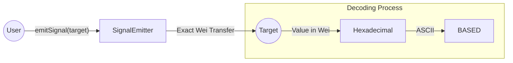

# Signal Emitter

**On-chain steganography for the Base ecosystem.**
Encoding human-readable intent into the raw `value` of native ETH transfers.

> "Simplicity is the ultimate sophistication."

---

## The Concept

Standard on-chain communication relies on `calldata` or `events`, which consume extra gas and leave a visible footprint. 
**Critique:** In a minimalist architecture, every byte counts. If we only need to signal a state or a simple "handshake," using data fields is overkill.

## The Solution: Value Steganography

**Signal Emitter** utilizes the native `value` field of an Ethereum transaction to carry data. By sending an exact amount of Wei, we can transmit ASCII messages that are invisible to the casual observer but clear to anyone viewing the blockchain through a hex-lens.

For example, the amount **284,558,263,620 Wei** is functionally "dust" (fractions of a cent), but its hexadecimal representation is `0x4241534544`, which decodes directly to the word **"BASED"**.

---

## Architecture

---

## Design Philosophy

1. **Zero-Data Overhead:** No `calldata` is used for the message itself.
2. **First Principles:** Utilizing the core economic layer (ETH transfer) as a communication channel.
3. **Resilience:** The contract ignores refund failures to ensure the primary signal is always delivered, regardless of the sender's wallet complexity.

---

## Tech Stack

* **Language:** Solidity 0.8.26
* **Framework:** Foundry
* **Network:** Base Mainnet

## License

MIT

### Author

Built with 💙 by [Roman](https://www.linkedin.com/in/tilmatochek/).
